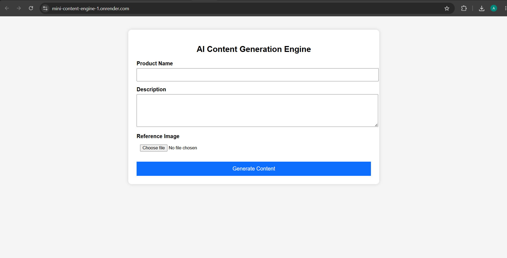
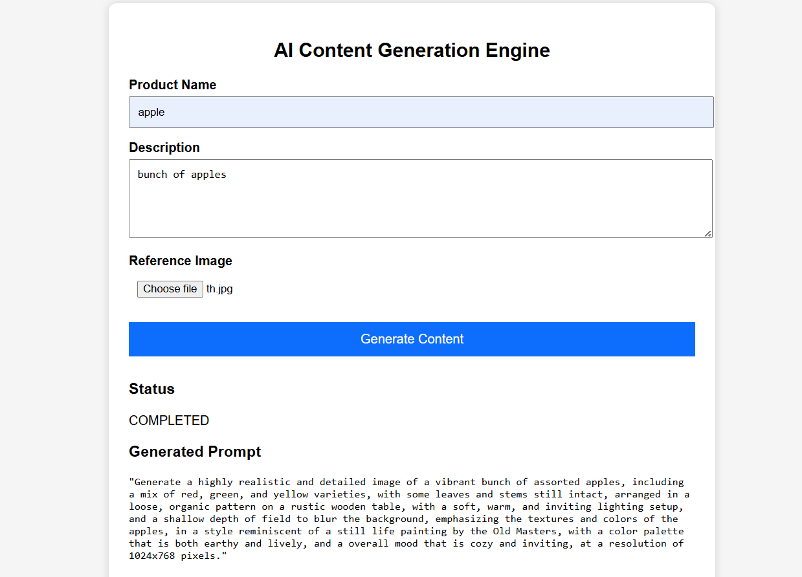

# 🚀 Mini Content Engine

A Django-based AI-powered content generation application that creates detailed image generation prompts from product information and a reference image. The application uses the **Groq API** for prompt generation and provides REST APIs for creating and tracking generation jobs.

---

## 🌐 Live Demo

**Website:** https://mini-content-engine-1.onrender.com/

---

## 📌 Features

- AI-powered prompt generation using Groq LLM
- Upload a reference product image
- Generate detailed image prompts
- Track generation status using Job ID
- RESTful API built with Django REST Framework
- PostgreSQL database integration
- Responsive HTML frontend
- Production deployment on Render

---

## 🛠 Tech Stack

### Backend
- Django 6
- Django REST Framework
- PostgreSQL
- Groq API

### Frontend
- HTML
- CSS
- JavaScript

### Deployment
- Render
- Gunicorn
- WhiteNoise

---

## 📂 Project Structure

```
mini_content_engine/
│
├── config/
├── jobs/
├── templates/
├── static/
├── media/
├── requirements.txt
├── manage.py
└── README.md
```

---

## ⚙️ Installation

### 1. Clone the repository

```bash
git clone https://github.com/akhil-007-tech/mini_content_engine.git
cd mini_content_engine
```

### 2. Create virtual environment

Windows

```bash
python -m venv venv
venv\Scripts\activate
```

Linux / Mac

```bash
python3 -m venv venv
source venv/bin/activate
```

---

### 3. Install dependencies

```bash
pip install -r requirements.txt
```

---

### 4. Configure Environment Variables

Create a `.env` file in the project root.

```env
SECRET_KEY=your_secret_key

DEBUG=True

GROQ_API_KEY=your_groq_api_key

DB_NAME=your_database_name
DB_USER=your_database_user
DB_PASSWORD=your_database_password
DB_HOST=your_database_host
DB_PORT=5432
```

---

### 5. Apply migrations

```bash
python manage.py migrate
```

---

### 6. Start the development server

```bash
python manage.py runserver
```

Visit

```
http://127.0.0.1:8000/
```

---

# API Endpoints

## Generate Prompt

**POST**

```
/api/generate/
```

### Form Data

| Field | Type |
|---------|------|
| product_name | Text |
| description | Text |
| reference_image | Image |

### Response

```json
{
    "message": "Job created successfully",
    "job_id": "xxxxxxxx-xxxx-xxxx-xxxx-xxxxxxxxxxxx",
    "status": "PENDING"
}
```

---

## Check Job Status

**GET**

```
/api/status/<job_id>/
```

Example

```
/api/status/958737db-a4ed-4a63-8365-45b5c425d811/
```

Response

```json
{
    "id": "...",
    "product_name": "...",
    "description": "...",
    "generated_prompt": "...",
    "generated_image_url": "...",
    "status": "COMPLETED"
}
```

---

# Workflow

1. User enters product details.
2. Uploads a reference image.
3. Backend stores the job in PostgreSQL.
4. Groq API generates a detailed image prompt.
5. Generated prompt is saved.
6. User checks job status using Job ID.

---

# Screenshots

## 🏠 Home Page



---

## ✨ Generated Prompt



---

## 🖼️ Generated Image


---

## 📋 Job Status


---

# Future Improvements

- Integrate Stable Diffusion API
- User authentication
- Prompt history
- Download generated images
- Image gallery
- Background job queue (Celery + Redis)
- Cloud image storage (AWS S3 / Cloudinary)

---

# Requirements

- Python 3.12+
- Django 6+
- PostgreSQL
- Groq API Key

---

# Author

**Akhil Chapala**

GitHub:
https://github.com/akhil-007-tech

LinkedIn:
https://www.linkedin.com/in/akhil-chapala-15096332a/

---

# License

This project is developed for educational and internship assessment purposes.
